## Authentication
### LAB: Username enumeration via different responses
> Lab yang mempunyai kerentanan dengan username dan password yang mudah ditebak. Disini kita disediakan wordlist username dan password yang akan digunakan untuk burtforce login page.

**1. Intercept Request Login**
   
**2. Send to Intruder**
   
**3. Set parameter bruteforce pada username**
   
**4. Paste Wordlist username pada payload configuration, lalu start attack**
   
**5. Cari satu satu respont yang menunjukan incorrect password, karena kita sedang brute force username berarti telah berhasil dengan username itu**
   
**6. Lakukan hal yang sama pada password tapi dengan usename yang sudah terisi dengan yang valid.**
   

### Lab: 2FA simple bypass
> Two-Factor Authentication (2FA) seharusnya mempunyai dua tahap keamanan: username + password dan kode verifikasi. Sering terjadi beberapa kasus dibeberapa website 2FA user login menggunakan username + password lalu diarahkan ke halaman input kode verifikasi atau OTP, tapi secara system user sudah dianggap telah login

**1. Login menggunakan username dan password yang sudah disediakan.**

**2. Ganti url halaman input kode verifikasi**

**3. dan berhasil**


## Server-side request forgery (SSRF)
   > Server-Side Request Forgery (SSRF) adalah kerentanan keamanan pada aplikasi web yang terjadi ketika aplikasi mengizinkan pengguna memengaruhi atau mengendalikan permintaan (request) yang dibuat oleh server ke suatu URL atau layanan lain tanpa validasi yang memadai. Kerentanan ini memungkinkan penyerang menyalahgunakan kepercayaan server untuk mengakses resource yang seharusnya hanya dapat diakses secara internal, seperti layanan internal jaringan, API internal, atau metadata layanan cloud, serta memaksa server melakukan koneksi ke sistem eksternal yang dikendalikan penyerang. Dampak dari SSRF dapat mencakup kebocoran data sensitif, pengungkapan kredensial, pemetaan jaringan internal, hingga eskalasi serangan yang berujung pada pengambilalihan sistem atau infrastruktur.

### Lab: Basic SSRF against the local server
> Laboratorium ini memiliki fitur pemeriksaan stok yang mengambil data dari sistem internal. Untuk memecahkan lab, ubah URL pemeriksaan stok untuk mengakses antarmuka admin di http://localhost/admin dan hapus carlos pengguna.

**1. Cari fitur pemeriksaan stok dan cek request**
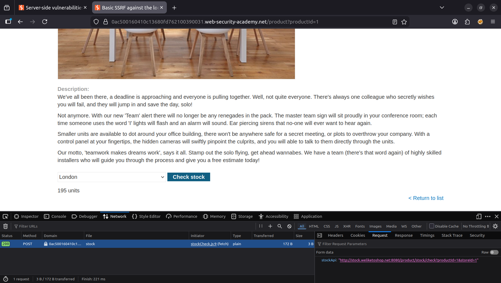
**2. Intercept request dan send to repeater**
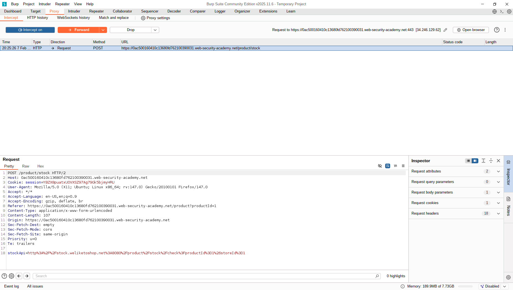
**3. Ganti API dengan `http://localhost/admin`, send untuk liat respone**
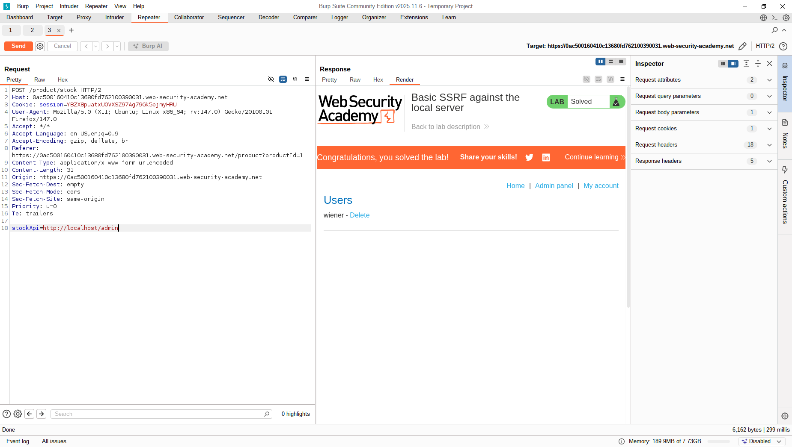
**4. Tambahkan parameter `/delete?username=carlos` pada url, send untuk melihat respone**
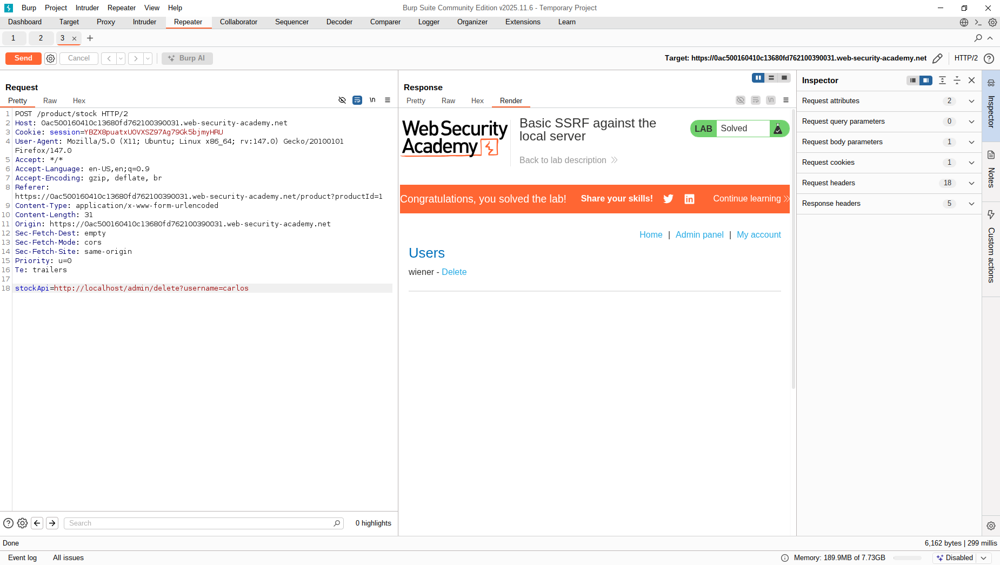

### Lab: Basic SSRF against another back-end system
> Laboratorium ini memiliki fitur pemeriksaan stok yang mengambil data dari sistem internal. Untuk memecahkan laboratorium, gunakan fungsi pemeriksaan stok untuk memindai internal 192.168.0. Kisaran X untuk antarmuka admin pada port 8080, lalu gunakan untuk menghapus carlos pengguna.

**1. Cari fitur pemeriksaan stok dan cek request**
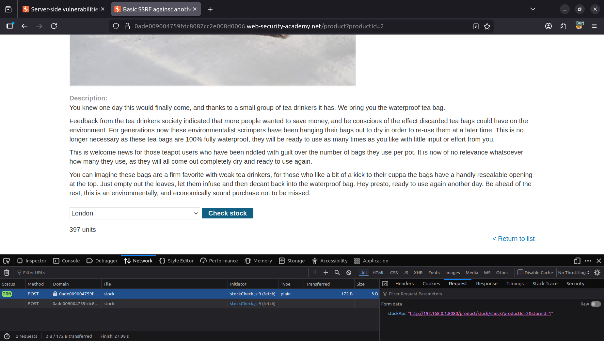

**2. Intercept request dan send to repeater**
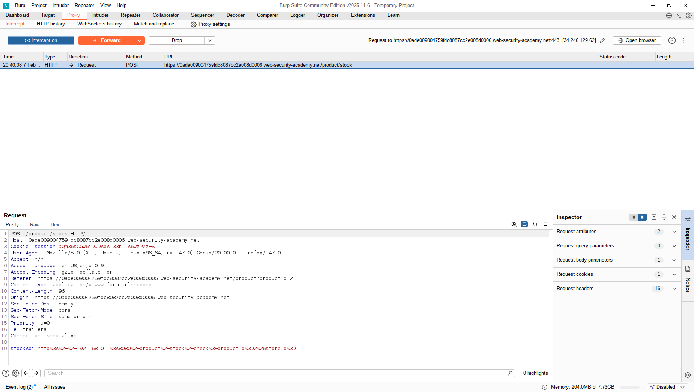

**3. Ubah API stok menjadi `http://192.168.0.1:8080/admin`, lalu send to intruder**
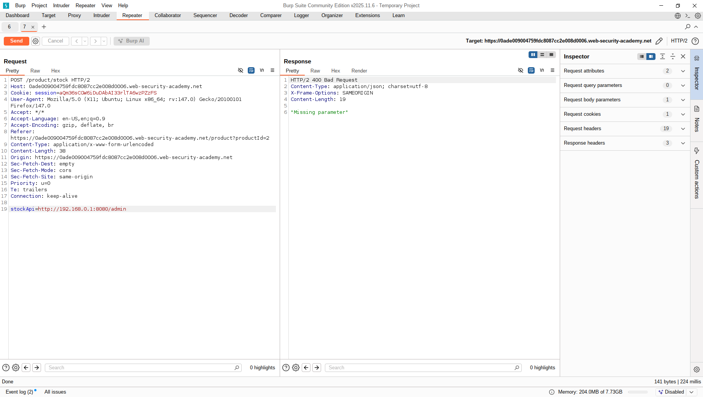

**4. Set parameter bruteforce pada ip host (angka 1), set payloads pada number 1 - 255 dan start attack**
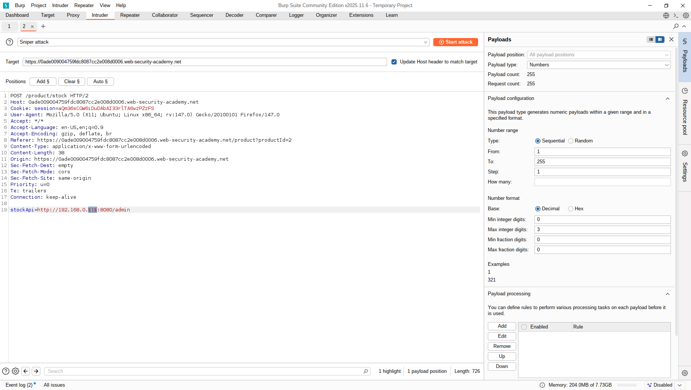

**5. Cari status code yang berhasil(200), dan tandai requestnya(disini request yang berhasil 126)**
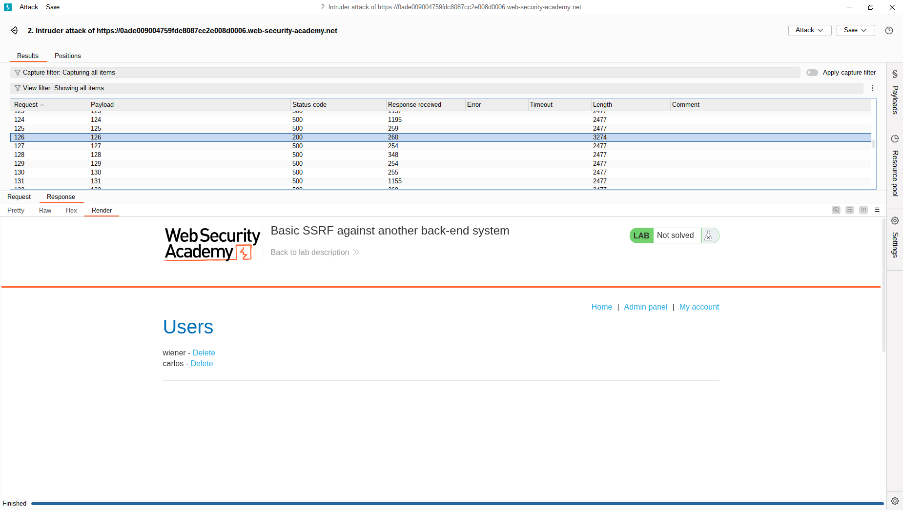

**6. Kembali ke repeater ubah ip host yang berhasil(angka 1 menjadi 126), tambahkan parameter `/delete?username=carlos` pada url, send**
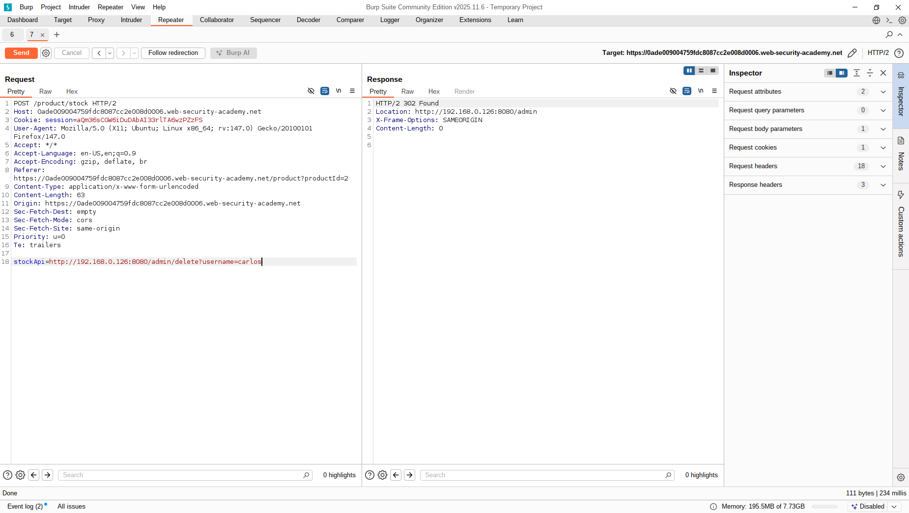

**7. hapus parameter `/delete?username=carlos` untuk mengetahui user carlos apakah berhasil dihapus**


## File Upload Vulnerability
> Vuln ini adalah kerentanan yang dimana server atau aplikasi tidak menerapkan validasi pada input file/fungsi upload file, seperti jenis, ukuran, nama. Karena tidak ada validasi atau pembatasan vuln ini sering dimanfaatkan oleh attacker untuk mengupload skrip berbahaya disisi server.

> Sekarang hampir tidak ada app dengan input file tanpa batasan, tapi vuln ini tetap terjadi sering disebabkan oleh developer yang salah atau lemah dalam menerapkan batasan sehingga mudah dilewati oleh attacker

### Lab: Remote code execution via web shell upload
> Pada lab ini terdapat kerentanan file upload, kita akan upload file script yang digunakan untuk melihat file pada ``home/carlos/secret``

1. Login sebagai username: wiener & password: peter
2. Buat file script dengan nama ``exploit.php``

```bash
<?php echo file_get_contents('/home/carlos/secret'); ?>
```
3. Upload file pada form
4. Intercept menggunakan burp suite, cari request avatar.
5. Ganti request ke file script yang sudah di upload.

6. Submit password atau isi file dari ``/home/carlos/secret``

### Lab: Web shell upload via Content-Type restriction bypass

1. Login sebagai username: wiener & password: peter
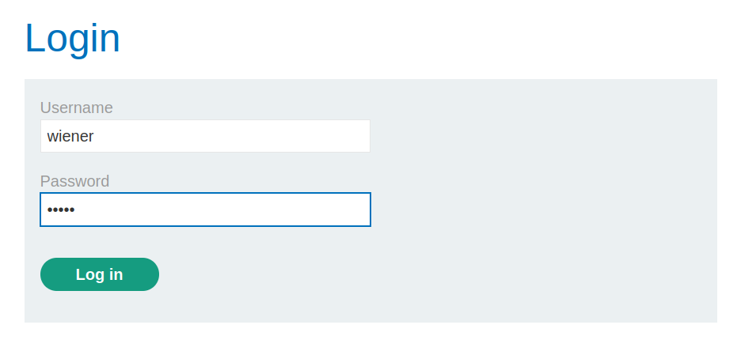

2. Buat file script dengan nama ``exploit.php``

```bash
<?php echo file_get_contents('/home/carlos/secret'); ?>
```

3. Upload file script pada form input.
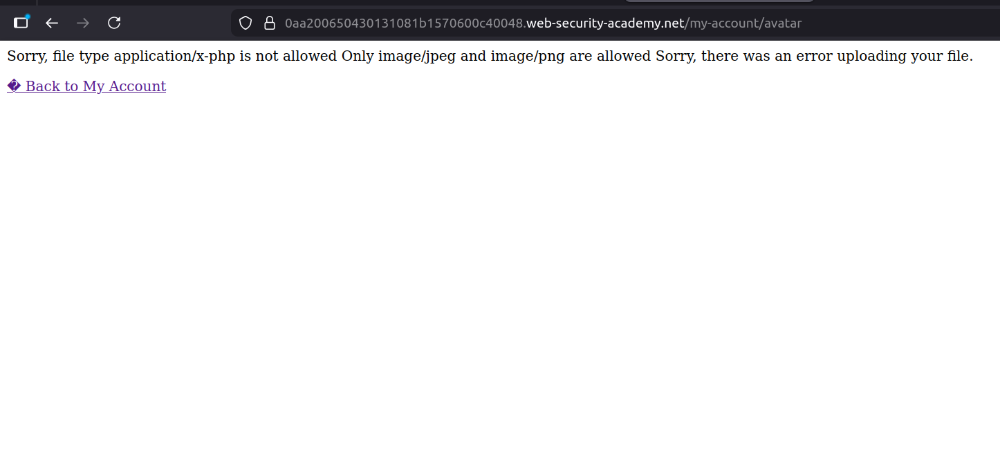
> Terjadi error karena ada pembatasan.

4. Intercept request menggunakan burpsuite, lalu send to repeater.
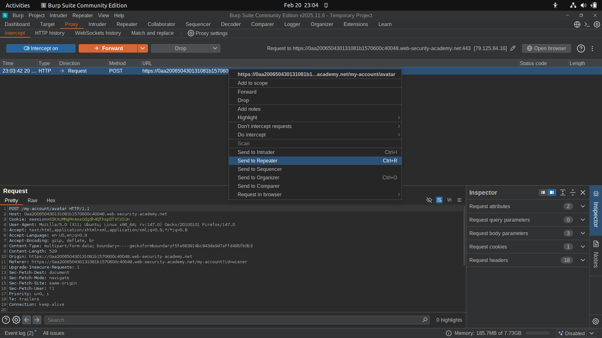

5. Ubah ``application/x-php;`` menjadi ``Content-Type: image/jpeg;``.
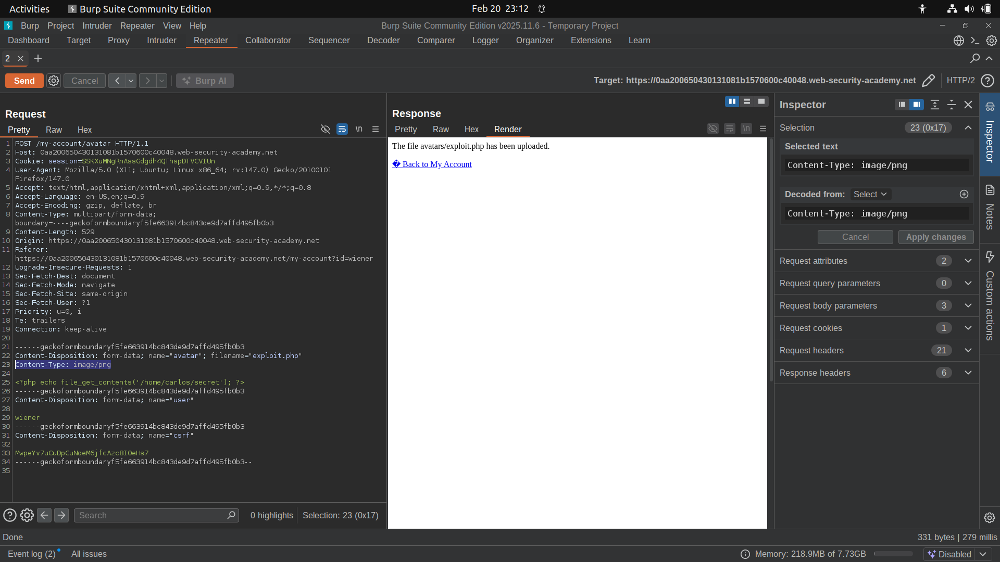

6. Kembali ke request avatar, ubah request ke file script yang sudah diupload.
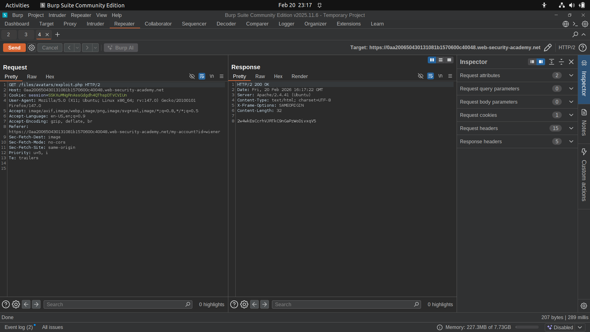

7. Submit password atau isi file dari ``/home/carlos/secret``

## OS Command Injection
> OS Command Injection adalah kerentanan ketika aplikasi menjalankan perintah sistem operasi (system command) dengan memasukkan input dari user tanpa validasi yang aman, sehingga penyerang bisa menyisipkan perintah tambahan dan membuat server menjalankan command berbahaya.

### Lab: OS command injection, simple case

1. Akses lab, cari fungsi cek stok product
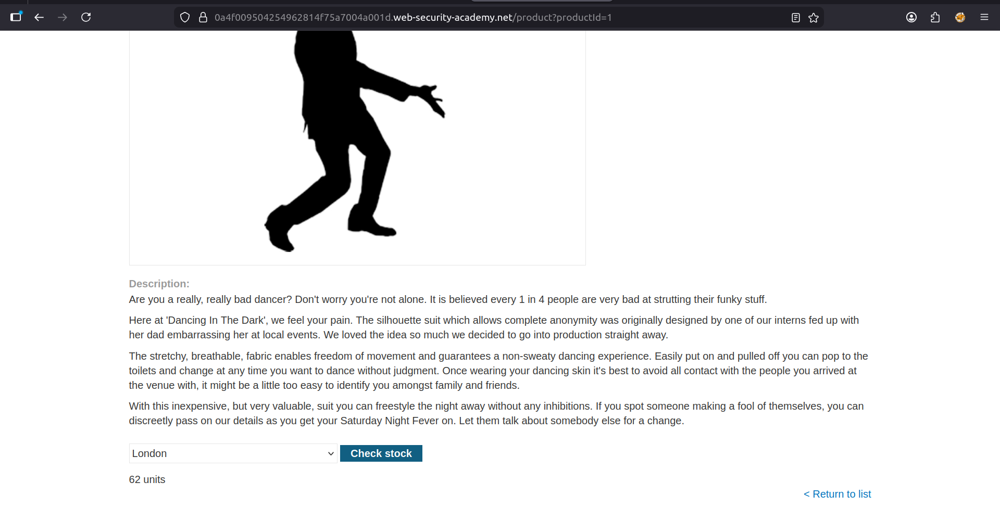

2. Intercept request menggunakan burpsuite, lalu send to repeater
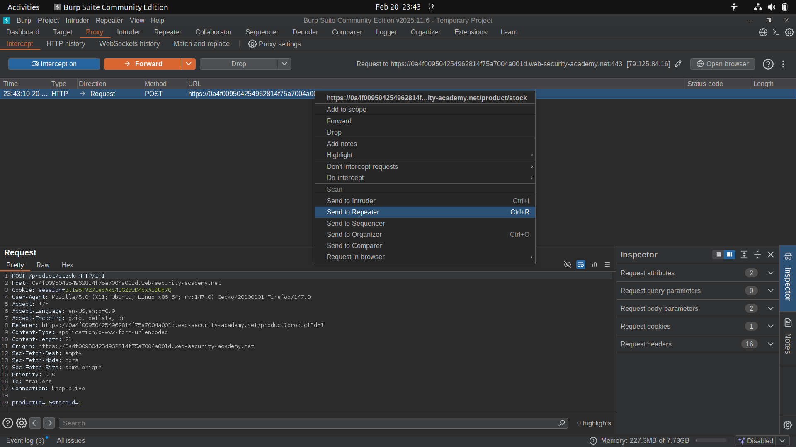

3. Tambahkan ``| whoami``
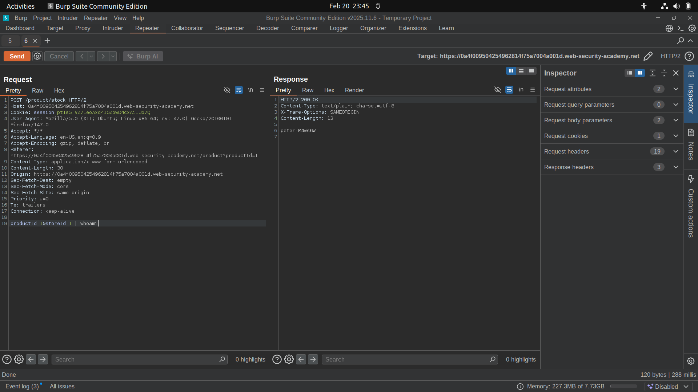

## SQL Injection
> Vuln ini adalah kerentanan dimana attacker dapat memodifikasi query dari aplikasi ke database, hal ini memungkinkan attacker untuk mengambil data user lain, menghapus data, ataupun mengubah data.

### Lab: SQL injection vulnerability in WHERE clause allowing retrieval of hidden data

1. Akses lab dan lakukan intercept saat request category


2. Send to repeater
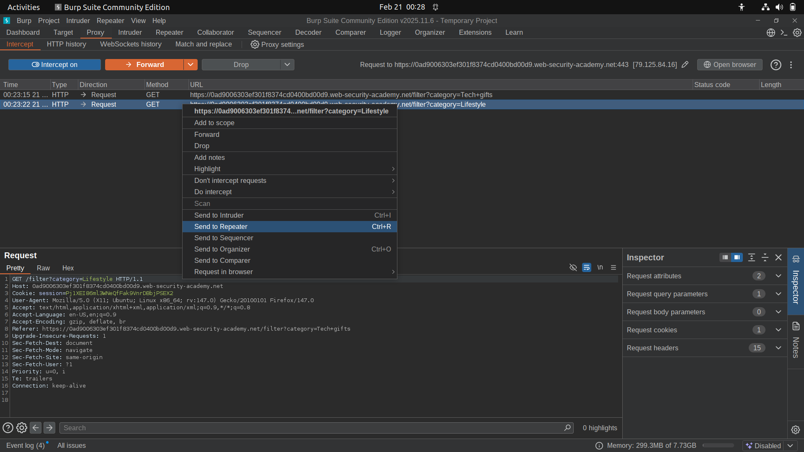

3. Masukkan paylod sqli ``'+OR+1=1--``
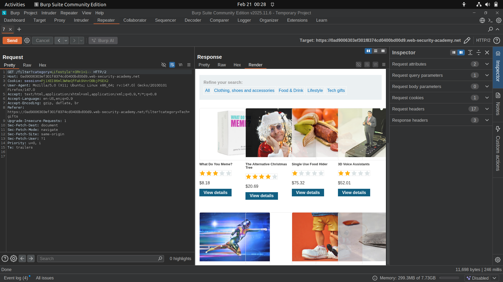

### Lab: SQL injection vulnerability allowing login bypass
1. Masuk halaman login
2. Masukkan payload sqli
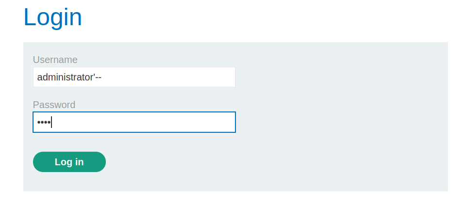
