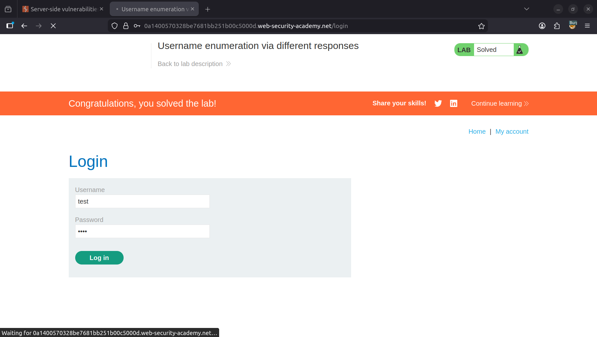
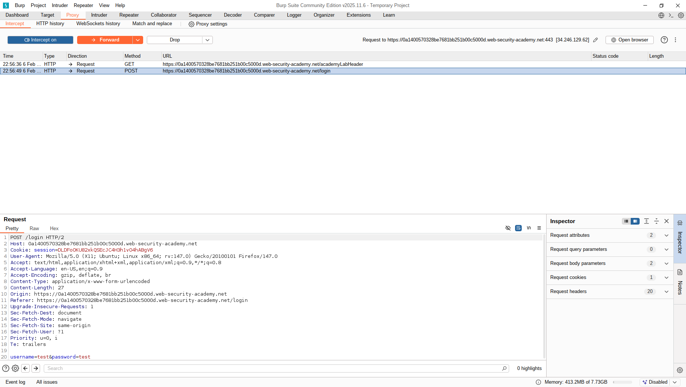
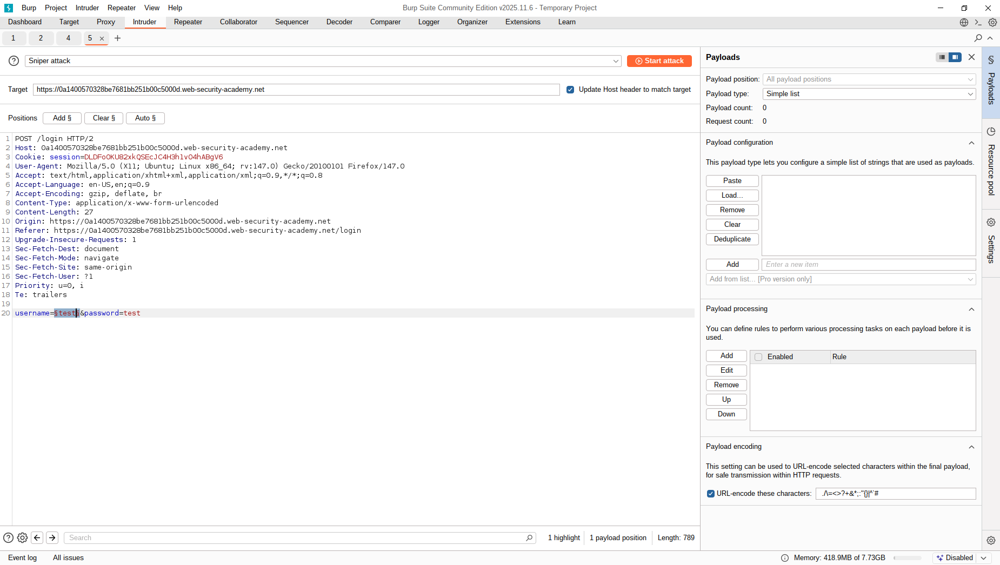
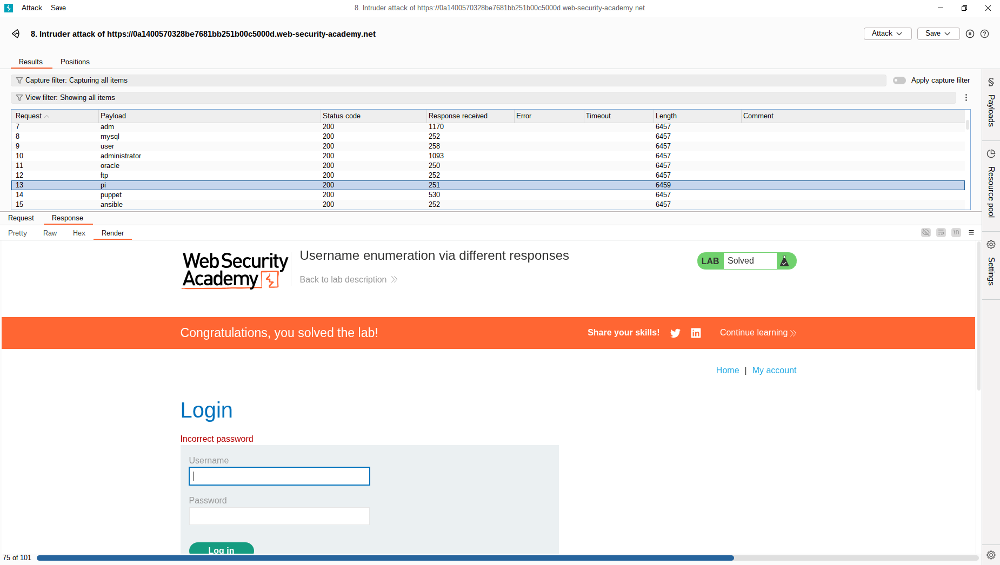
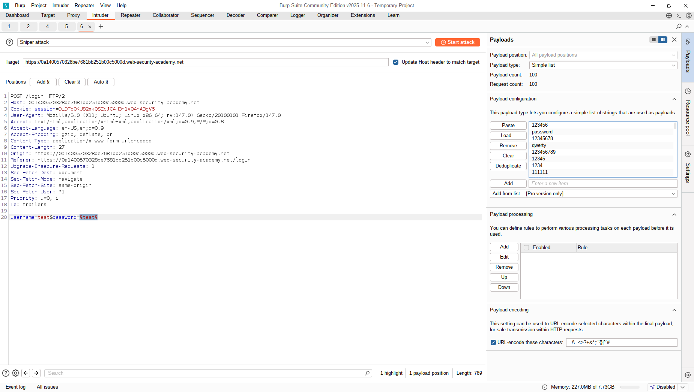
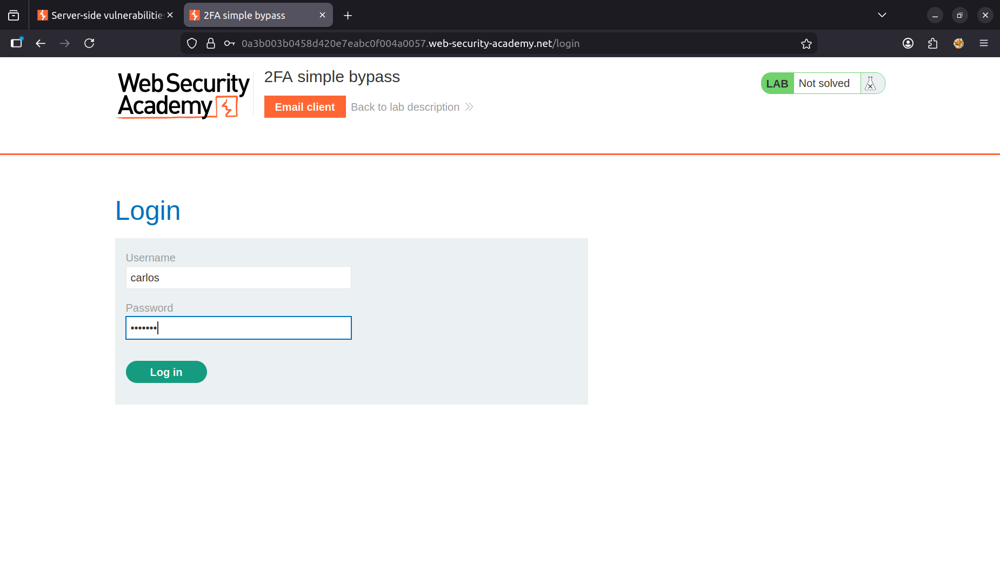
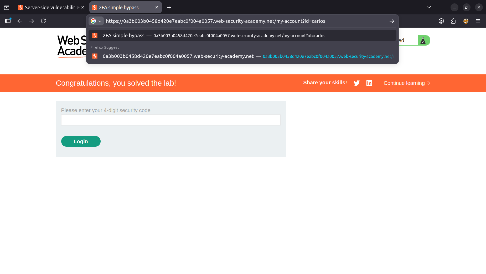
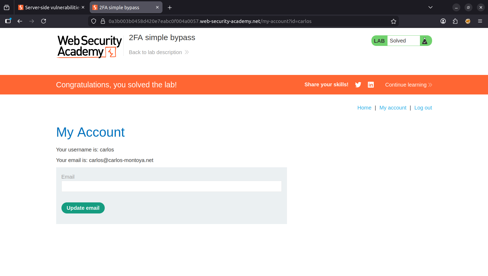

## Authentication
### LAB: Username enumeration via different responses
> Lab yang mempunyai kerentanan dengan username dan password yang mudah ditebak. Disini kita disediakan wordlist username dan password yang akan digunakan untuk burtforce login page.

**1. Intercept Request Login**
   
**2. Send to Intruder**
   
**3. Set parameter bruteforce pada username**
   
**4. Paste Wordlist username pada payload configuration, lalu start attack**
   
**5. Cari satu satu respont yang menunjukan incorrect password, karena kita sedang brute force username berarti telah berhasil dengan username itu**
   
**6. Lakukan hal yang sama pada password tapi dengan usename yang sudah terisi dengan yang valid.**
   

### Lab: 2FA simple bypass
> Two-Factor Authentication (2FA) seharusnya mempunyai dua tahap keamanan: username + password dan kode verifikasi. Sering terjadi beberapa kasus dibeberapa website 2FA user login menggunakan username + password lalu diarahkan ke halaman input kode verifikasi atau OTP, tapi secara system user sudah dianggap telah login

**1. Login menggunakan username dan password yang sudah disediakan.**

**2. Ganti url halaman input kode verifikasi**

**3. dan berhasil**

